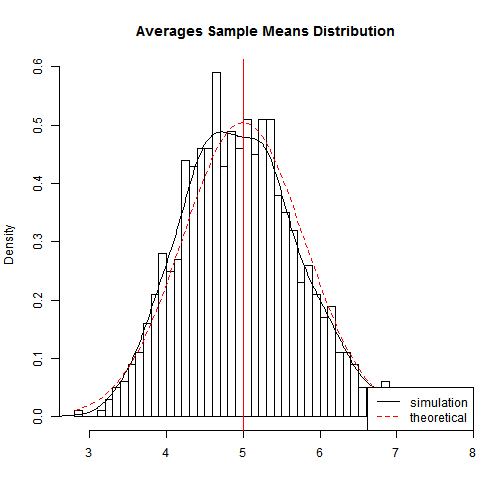

Developing Data Products Course 9 Project - Shiny App
========================================================
author: 
date: 26 April 2015

About the Shiny application
========================================================
A simple shiny application that shows how interactive 
applications help to speed up testing statistical 
inferences.

This is a simple application that allows the User to key in the
required test parameters and then performs an Exponential Distribution Simulation to see if the figures gel with
the CLT - Central Limit Theoram.

As the application shows, technology nowadays allow for
a data product to be easily built for an End-User, one
who need not have to go through pages of mathematical or
statistical or technical jagon just to use the information.

Although in this simple application, due to time constraints, 
the User must have some idea what the CLT means - to key in
meaningful values into the parameters.

About the simulation algorithm
========================================================
The application backend code is base on this student's 
project from Course 6 Statistical Inference, Part I - Exponential Distribution Simulation.

That exercise investigated the distribution of averages of 40 numbers sampled from the exponential distribution with $\lambda$ = 0.2 and 1000 simulations. 

That simulation used a fixed Seed of 1234, to obtain the distributed averages using lambda of 0.2, and generated the sample means distribution and compared it with the theoratical mean of the distribution (CLT).

The next 2 slides shows the 2 results from the simulation.
They are the initial default results when the User opens 
the application.

Simulated vs Theoram
========================================================


```
                Mean Variance
Simulated   4.974239  24.3531
Theoretical 5.000000  25.0000
```


Simulated vs Theoram plotted
========================================================
 

~~~~~~~~~~~ The End ~~~~~~~~~~~
